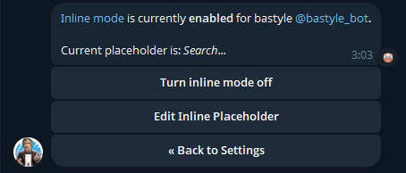
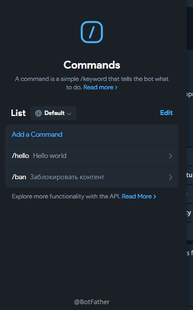
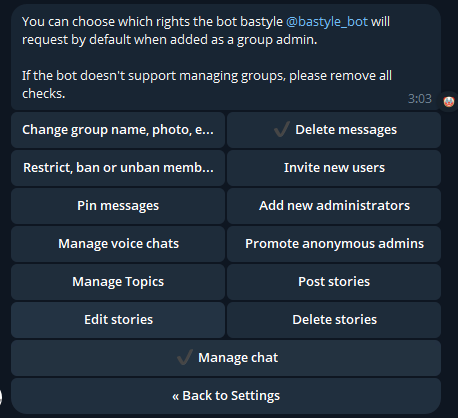

# Bastyle Blacklist

Версия: `v1.1.1`

`Bastyle Blacklist` - Telegram-бот для автоматической модерации медиа в
групповых чатах. Бот помогает администраторам один раз заблокировать нежеланный
контент и дальше автоматически удаляет повторные отправки этого же или похожего
медиа.

## Назначение

Задача бота - уменьшить ручную модерацию в Telegram-группах, где
пользователи повторно отправляют запрещенные картинки, GIF-анимации или
стикеры.

Основной сценарий:

1. Администратор отвечает на нежелательное медиа командой `/ban`.
2. Бот проверяет права администратора.
3. Бот сохраняет fingerprint контента в blacklist.
4. Бот удаляет исходное сообщение.
5. При повторной отправке совпадающего контента бот удаляет сообщение
   автоматически.

## Возможности `v1.1.0`

- exact-match по Telegram `file_unique_id`;
- perceptual hash matching для фото и статичных стикеров;
- video-like matching для Telegram animations и video stickers;
- извлечение кадров через FFmpeg для GIF/video-like контента;
- SQLite-хранилище fingerprints;
- проверка прав администратора перед `/ban`;
- автоматическое удаление заблокированных сообщений;
- настройка лимитов для animation/video sticker обработки;
- отключаемый `video_like` matcher через YAML config.

## Ограничения бота

Вне зоны ответственности:

- Telegram видео и документы;
- видеоматериалы со значительными изменениями: кадрированием (crop), оверлеями, водяными знаками, изменением скорости или агрессивным монтажом.

## Требования

- Go `1.25.4` или совместимая версия;
- Telegram bot token от `@BotFather`;
- FFmpeg, если включен `matching.video_like.enabled`;
- доступ на запись к SQLite-файлу;
- бот добавлен в группу администратором;
- у бота есть право удалять сообщения.

Проверить FFmpeg:

```bash
ffmpeg -version
```

## Настройка В Telegram

### 1. Создать Бота

Создайте бота через `@BotFather` и получите token. Token указывается в
`configs/config.yaml`:

```yaml
telegram:
  token: "your-telegram-bot-token"
```

### 2. Включить Inline Mode

В `@BotFather` включите inline mode для бота.

Ожидаемое состояние: inline mode включен, placeholder может быть `Search...`.



### 3. Добавить Команды

В `@BotFather` настройте команды бота.

Ожидаемый список команд:



Команды в runtime:

- `/hello` - проверочная команда, отвечает `Hello, World!`;
- `/ban` - блокирует медиа из сообщения, на которое сделан reply.

### 4. Добавить Бота В Группу

Добавьте бота в группу как администратора.

Минимально необходимое право:

- `Delete messages`.

У бота должно быть право удалять сообщения. Остальные права можно не выдавать,
если они не нужны для вашей группы.



## Конфигурация

Создайте рабочий config:

```bash
cp configs/config.example.yaml configs/config.yaml
```

Пример полной конфигурации:

```yaml
telegram:
  token: "your-telegram-bot-token"
  update_timeout_seconds: 5

workers: 5
jobs_buffer: 100

matching:
  exact:
    buffer: 500

  image_hash:
    db_path: "bastyle.sqlite"
    threshold: 12
    buffer: 500

  video_like:
    enabled: true
    max_animation_duration: 10s
    max_video_sticker_duration: 3s
    max_animation_size: 20MiB
    max_video_sticker_size: 256KiB
    db_path: "bastyle.sqlite"
    threshold: 12
    buffer: 500
    min_matched_frames: 2
    min_matched_ratio: 0.4
    max_frames: 10
    target_width: 320
    target_height: 320
    ffmpeg_binary: ffmpeg
    ffmpeg_timeout: 10s
```

### Основные Параметры

`telegram.token` - token Telegram-бота.

`workers` - количество worker'ов для обработки сообщений.
`jobs_buffer` - размер очереди сообщений.

`matching.exact.buffer` - стартовый размер черного списка по `file_unique_id` в памяти приложения.
`matching.image_hash.db_path` - SQLite-файл для хэшей картинок.
`matching.image_hash.threshold` - максимальная Hamming distance для похожих изображений.
`matching.video_like.enabled` - включает или отключает video-like matcher.
`matching.video_like.db_path` - SQLite-файл для video-like отпечатков.
`matching.video_like.min_matched_frames` - минимальное количество совпавших
кадров. Значение больше `1` защищает от false positive по одному похожему кадру.
`matching.video_like.min_matched_ratio` - минимальная доля совпавших кадров.
`matching.video_like.max_animation_duration` и
`matching.video_like.max_video_sticker_duration` - лимиты длительности перед
скачиванием/обработкой.
`matching.video_like.max_animation_size` и
`matching.video_like.max_video_sticker_size` - лимиты размера.
`matching.video_like.ffmpeg_binary` - имя бинарника или полный путь до FFmpeg.
`matching.video_like.ffmpeg_timeout` - timeout на извлечение кадров.

## Запуск

Локально:

```bash
go run ./cmd/main.go -config configs/config.yaml
```

После успешного запуска бот пишет в лог:

```text
Authorized as <bot_username>
```

## Makefile И CI

Основные команды:

```bash
make test
make build
make ci
```

`make ci` запускает `go vet`, тесты и сборку бинарника в
`build/bin/bastyle-blacklist`.

В репозитории добавлен GitHub Actions workflow `.github/workflows/ci.yml`.
Он запускает `make ci` и отдельно проверяет сборку Docker-образа.

## Docker

Сборка:

```bash
docker build -f build/Dockerfile -t bastyle-blacklist:1.1.1 .
```

Запуск:

```bash
docker run --rm \
  --memory 512m \
  --memory-swap 512m \
  -v "$PWD/configs/config.yaml:/etc/bastyle/config.yaml:ro" \
  -v bastyle-data:/var/lib/bastyle \
  bastyle-blacklist:1.1.1
```

Для Docker удобно указывать SQLite-файл внутри `/var/lib/bastyle`:

```yaml
matching:
  image_hash:
    db_path: "/var/lib/bastyle/bastyle.sqlite"
  video_like:
    db_path: "/var/lib/bastyle/bastyle.sqlite"
```

## Docker Compose

Запуск через Compose:

```bash
cp configs/config.example.yaml configs/config.yaml
docker compose up -d --build
```

Остановка:

```bash
docker compose down
```

Compose монтирует config в `/etc/bastyle/config.yaml`, данные в
`/var/lib/bastyle` и ограничивает контейнер `512m` памяти.

## Systemd

Сборка и установка бинарника:

```bash
make build
sudo install -o root -g root -m 0755 build/bin/bastyle-blacklist /usr/local/bin/bastyle-blacklist
```

Подготовка пользователя, config и директории данных:

```bash
id -u bastyle >/dev/null 2>&1 || sudo useradd --system --home-dir /var/lib/bastyle --create-home --shell /usr/sbin/nologin bastyle
sudo install -d -o bastyle -g bastyle -m 0750 /var/lib/bastyle
sudo install -d -o root -g root -m 0755 /etc/bastyle
sudo install -o root -g root -m 0640 configs/config.example.yaml /etc/bastyle/config.yaml
```

В `/etc/bastyle/config.yaml` укажите Telegram token и production-пути к SQLite:

```yaml
matching:
  image_hash:
    db_path: "/var/lib/bastyle/bastyle.sqlite"
  video_like:
    db_path: "/var/lib/bastyle/bastyle.sqlite"
```

Установка unit-файла:

```bash
sudo install -o root -g root -m 0644 build/bastyle-blacklist.service /etc/systemd/system/bastyle-blacklist.service
sudo systemctl daemon-reload
sudo systemctl enable --now bastyle-blacklist
```

Проверка:

```bash
systemctl status bastyle-blacklist
journalctl -u bastyle-blacklist -f
```

Unit запускает бот от пользователя `bastyle`, хранит рабочие данные в
`/var/lib/bastyle`, читает config из `/etc/bastyle/config.yaml` и ограничивает
процесс `512M` памяти.

## Использование

Заблокировать медиа:

1. Найдите сообщение с нежелательным медиа.
2. Ответьте на него командой `/ban`.
3. Бот удалит сообщение и сохранит fingerprint.

Проверить работу:

1. Отправьте то же медиа повторно.
2. Бот должен удалить сообщение автоматически.

Если `/ban` отправил не администратор, бот не добавит контент в blacklist.

## Проверка Перед Релизом

Тесты:

```bash
go test ./...
```

Benchmark поиска по video-like index:

```bash
go test ./internal/adapters/matching/videolike \
  -bench BenchmarkVideoLikeLinearIndexSearch \
  -run '^$' \
  -benchtime=3s \
  -count=1
```

Benchmark FFmpeg extraction:

```bash
go test ./internal/adapters/media \
  -bench BenchmarkFFmpegFrameExtractorSmallAnimation \
  -run '^$' \
  -benchtime=3s \
  -count=1
```

## Что Изменилось В `v1.1.0`

- добавлена поддержка блокировок gif и анимированных стикеров;
- добавлены tests и benchmarks для video-like слоя.
